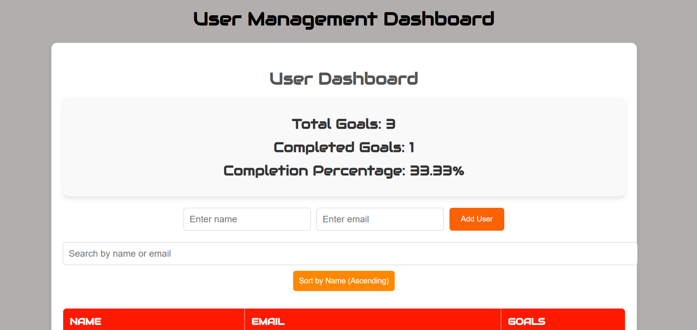

#  React Dashboard

A user-friendly React Dashboard for goal tracking, user management, and analytics.

##  Screenshot



##  Features

-  Add new users with name and email.
-  Goal tracking with real-time progress updates.
-  Summary dashboard displaying goal completion percentages.
-  User search and sorting functionality.

## 🛠️ Installation

```sh
Live at https://amolnaikwade.github.io/Dashboard/
cd Dashboard
npm install
npm start
